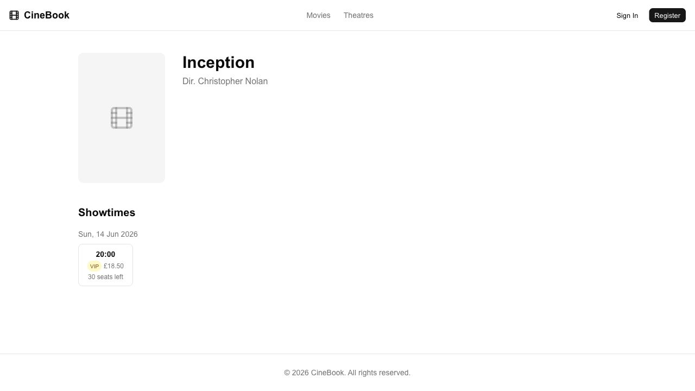
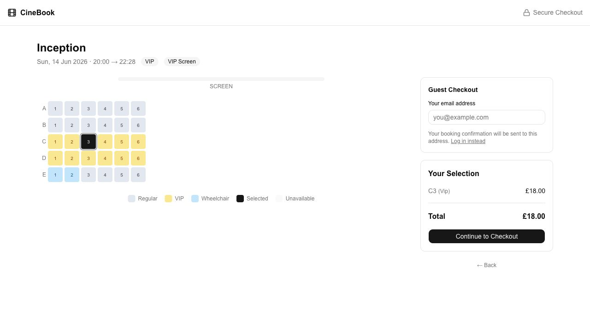
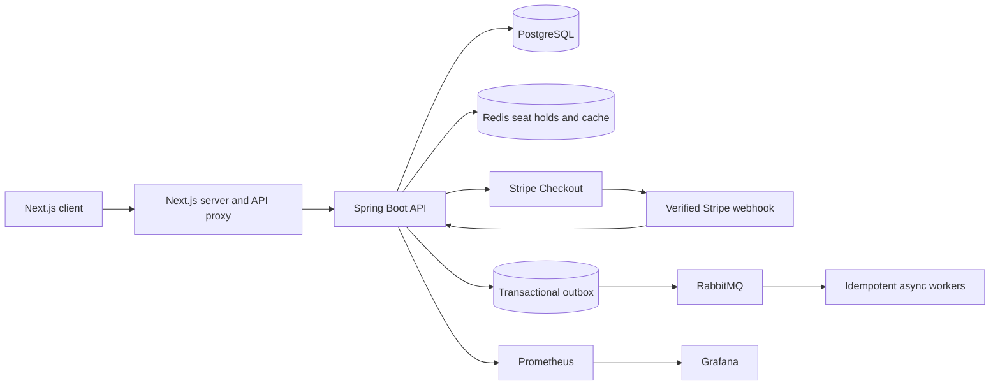

# CineBook Movie Reservation

[](https://github.com/timothyho512/movie-reservation/actions/workflows/ci.yml)

A full-stack cinema booking application built around the difficult parts of online
ticketing: concurrent seat selection, expiring holds, idempotent payment retries,
verified Stripe webhooks, and reliable asynchronous processing.

The project supports guest and authenticated checkout, customer booking history,
cinema administration, operational reporting, and local observability.

## Live Demo

- Frontend: [movie-reservation-beige.vercel.app](https://movie-reservation-beige.vercel.app)
- Backend health: [Render health endpoint](https://movie-reservation-api-qehk.onrender.com/actuator/health)

The portfolio deployment uses free infrastructure. Render puts the backend to
sleep after inactivity, so the first request can take several minutes. The
frontend displays a wake-up message and retries temporary client-side failures
while the service starts.

Stripe runs in test mode; no real payment is collected. Production
administrator credentials are intentionally not published.

## Screenshots

### Movie And Showtime



### Interactive Seat Selection



## Highlights

- Redis-backed seat holds prevent two customers from locking the same seat.
- Stable idempotency keys make lock and checkout retries safe.
- Stripe Checkout handles payment collection.
- Verified Stripe webhooks are the authority for reservation creation.
- Duplicate and concurrent webhook deliveries cannot create duplicate bookings.
- Late or unsafe successful payments enter an idempotent refund flow.
- A transactional outbox reliably transfers booking events from Postgres to RabbitMQ.
- RabbitMQ consumers use consumer-side idempotency for at-least-once delivery.
- JWT authentication separates customer, manager, and administrator access.
- Versioned seat layouts preserve historical showtime and reservation data.
- Prometheus metrics and a provisioned Grafana dashboard expose checkout behavior.
- GitHub Actions runs backend integration tests and frontend checks on every push.

## Application Features

### Customer Booking

- Browse movies, theatres, showtimes, and live seat availability.
- Select regular, VIP, and wheelchair seats.
- Continue as a guest or authenticated customer.
- Hold seats temporarily with a visible countdown.
- Pay through hosted Stripe Checkout.
- Poll payment status until the webhook finalizes the reservation.
- View booking history and booking details.
- Cancel eligible reservations before the booking cutoff.

### Cinema Administration

- Manage movies, theatres, screens, and showtimes.
- Activate or deactivate cinema resources.
- Create immutable seat-layout versions for future showtimes.
- View occupancy, revenue, cancellation, popular-seat, and checkout-conversion reports.
- Restrict administration routes to `ADMIN` and `MANAGER` roles.

## Architecture



### Booking Flow

1. The customer selects seats from the current seat map.
2. Spring atomically creates temporary Redis holds.
3. The backend records the lock response against an idempotency key.
4. The backend creates an internal checkout and Stripe Checkout Session.
5. Stripe redirects the customer back while independently delivering a webhook.
6. The webhook verifies payment, locks the checkout row, and creates one reservation.
7. The same database transaction writes a booking event to the outbox.
8. A scheduled publisher sends the event to RabbitMQ for asynchronous processing.

Postgres is the source of truth for durable business data. Redis is the live
authority for temporary seat holds before payment.

## Technology

| Area | Technology |
| --- | --- |
| Frontend | Next.js 16, React 19, TypeScript, Tailwind CSS, TanStack Query, Zustand |
| Backend | Java 21, Spring Boot 4, Spring Security, Spring Data JPA |
| Data | PostgreSQL 16, Flyway, Redis 7 |
| Payments | Stripe Checkout and signed webhooks |
| Messaging | RabbitMQ and the transactional outbox pattern |
| Observability | Spring Actuator, Micrometer, Prometheus, Grafana |
| Testing | JUnit, Spring MockMvc, Mockito, Vitest, React Testing Library, k6 |
| Automation | GitHub Actions, Gradle, npm, Docker Compose |

## Reliability Decisions

### Concurrency-Safe Seat Holds

Redis `SET NX` operations provide the active lock boundary. A seat can only have
one owner for a showtime, while Postgres retains lock audit history.

### Idempotent Checkout

Seat-lock and checkout-session requests accept an `Idempotency-Key`. Repeating
the same request returns the original result; reusing the key for a different
request returns `409 Conflict`.

### Webhook Finalization

Reservations are created only from verified Stripe webhooks, never from the
browser redirect. Pessimistic locking and terminal checkout states protect
against duplicate and concurrent webhook deliveries.

### Transactional Outbox

Reservation state and its integration event are committed together in Postgres.
The outbox worker retries RabbitMQ publishing without losing the event when the
broker is temporarily unavailable.

## Verified Results

The backend suite contains **150+ tests**, including authentication,
authorization, checkout ownership, idempotency, webhook duplication, concurrent
finalization, refunds, reporting, lifecycle processing, and observability.

The frontend currently contains **13 focused unit/component tests** covering seat
interaction, accessibility state, booking status badges, lock expiry, checkout
state isolation, and delayed backend wake-up messaging.

| Scenario | Result |
| --- | --- |
| Same-seat contention | 1 successful lock and 99 clean conflicts from 100 attempts |
| Seat-map browsing | 1,000 successful responses; p95 `283.97 ms`, p99 `380.88 ms` |
| Checkout retry storm | 100 idempotent replays; p95 `128.20 ms`, p99 `130.01 ms` |

See [load testing documentation](docs/load-testing.md) for commands, thresholds,
and full observed output.

## Local Development

### Prerequisites

- Java 21
- Node.js 24 and npm
- Docker and Docker Compose
- A Stripe test account
- Stripe CLI

### 1. Configure Environment Variables

```sh
cp .env.example .env
```

Replace the Stripe placeholders and generate a private JWT signing secret:

```sh
openssl rand -base64 32
```

Store the generated value in `.env`:

```text
JWT_SECRET=generated-private-value
```

Never commit `.env` or real credentials.

### 2. Start Infrastructure

```sh
docker compose up -d db test-db redis rabbitmq
```

Local service ports:

| Service | Address |
| --- | --- |
| PostgreSQL | `localhost:5433` |
| Test PostgreSQL | `localhost:5434` |
| Redis | `localhost:6379` |
| RabbitMQ | `localhost:5672` |
| RabbitMQ management | [localhost:15672](http://localhost:15672) |

### 3. Start the Backend

```sh
set -a
source .env
set +a
./gradlew bootRun --args='--spring.profiles.active=dev'
```

The API runs at [localhost:8080](http://localhost:8080).

### 4. Forward Stripe Webhooks

In another terminal:

```sh
stripe login
stripe listen --forward-to localhost:8080/checkout/webhook/stripe
```

Copy the displayed `whsec_...` value into `STRIPE_WEBHOOK_SECRET` in `.env`,
then restart the backend.

### 5. Start the Frontend

```sh
cd frontend
npm ci
npm run dev
```

The application runs at [localhost:3000](http://localhost:3000).

## Demo Accounts

The `dev` profile seeds the following local accounts:

| Role | Email | Password |
| --- | --- | --- |
| Customer | `demo.customer@example.com` | `Password123!` |
| Administrator | `demo.admin@example.com` | `Password123!` |

The seed also creates fallback movies, theatres, screens, and seats. When a
`TMDB_ACCESS_TOKEN` is configured, the public catalogue uses four currently
playing UK films and their posters. Startup and daily maintenance keep a
rolling 14-day showtime window populated automatically.

These credentials are for local demo data only.

The production portfolio deployment seeds the catalogue and customer account
when `DEMO_DATA_ENABLED=true`. It intentionally leaves the administrator
account disabled.

## Testing

Start the test database and Redis:

```sh
docker compose up -d test-db redis
```

Run backend tests:

```sh
./gradlew test
```

Run frontend tests and checks:

```sh
cd frontend
npm test
npm run lint
npm run build
```

The same checks run in [GitHub Actions](https://github.com/timothyho512/movie-reservation/actions).

## Observability

Start the monitoring stack:

```sh
docker compose up -d prometheus grafana
```

- Prometheus: [localhost:9090](http://localhost:9090)
- Grafana: [localhost:3001](http://localhost:3001)
- Backend metrics: [localhost:8080/actuator/prometheus](http://localhost:8080/actuator/prometheus)

Grafana uses `admin` / `admin` by default unless overridden through environment
variables.

## Deployment

The public portfolio deployment uses:

| Component | Provider |
| --- | --- |
| Next.js frontend | Vercel |
| Spring Boot Docker service | Render |
| PostgreSQL | Neon |
| Redis | Upstash |
| RabbitMQ | CloudAMQP |
| Payments and webhooks | Stripe test mode |

The repository includes the Render Blueprint, production Spring configuration,
Docker image, Vercel environment example, and provider setup guide.

See the [free-tier deployment guide](docs/deployment.md) for the provider setup,
required environment variables, and deployment order.

## Documentation

- [Backend API contract](docs/api/backend-api.md)
- [Local development guide](docs/local-development.md)
- [Free-tier deployment guide](docs/deployment.md)
- [Checkout and payment lifecycle](docs/checkout/checkout-payment.md)
- [RabbitMQ and transactional outbox](docs/async/rabbitmq-outbox-async-work.md)
- [Reservation history and ownership](docs/reservations/reservation-history-details.md)
- [Database ER diagram](docs/diagrams/erd.md)
- [Load and concurrency testing](docs/load-testing.md)

## Current Limitations

- Render's free service sleeps after inactivity and introduces a cold-start delay.
- The first email worker logs booking email work instead of calling an email provider.
- Prometheus and Grafana are currently configured for local development.
- The portfolio deployment uses Stripe test mode and is not intended for real transactions.

## Roadmap

- Add Playwright end-to-end tests for booking and administration flows.
- Integrate a transactional email provider.
- Add hosted production observability.

## License

This project is available under the [MIT License](LICENSE).
