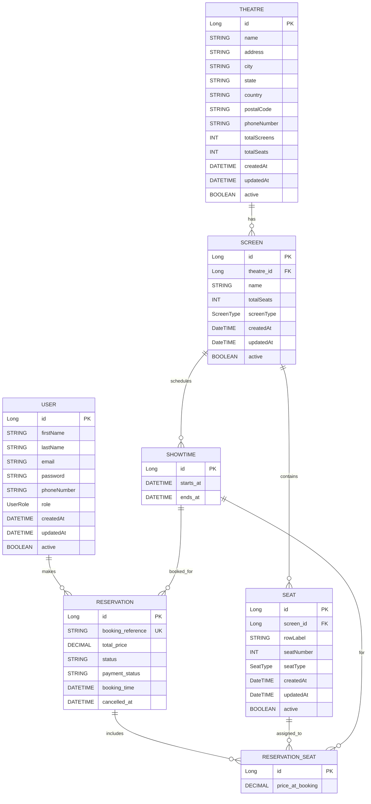

# Database ER Diagram

```mermaid
erDiagram
    USER ||--o{RESERVATION : makes
    SHOWTIME ||--o{ RESERVATION : booked_for

    THEATRE ||--o{ SCREEN : has
    SCREEN ||--o{ SEAT : contains
    SCREEN ||--o{ SHOWTIME : schedules

    RESERVATION ||--o{ RESERVATION_SEAT : includes
    SEAT ||--o{ RESERVATION_SEAT : assigned_to
    SHOWTIME ||--o{ RESERVATION_SEAT : for

    USER {
        Long id PK
        STRING firstName
        STRING lastName
        STRING email
        STRING password
        STRING phoneNumber
        UserRole role
        DATETIME createdAt
        DATETIME updatedAt
        BOOLEAN active
    }

    THEATRE {
        Long id PK
        STRING name
        STRING address
        STRING city
        STRING state
        STRING country
        STRING postalCode
        STRING phoneNumber
        INT totalScreens
        INT totalSeats
        DATETIME createdAt
        DATETIME updatedAt
        BOOLEAN active
    }

    SCREEN {
        Long id PK
        Long theatre_id FK
        STRING name
        INT totalSeats
        ScreenType screenType
        DateTIME createdAt
        DateTIME updatedAt
        BOOLEAN active
    }

    SEAT {
        Long id PK
        Long screen_id FK
        STRING rowLabel
        INT seatNumber
        SeatType seatType
        DateTIME createdAt
        DateTIME updatedAt
        BOOLEAN active
    }

    SHOWTIME {
        Long id PK
        DATETIME starts_at
        DATETIME ends_at
    }

    RESERVATION {
        Long id PK
        STRING booking_reference UK
        DECIMAL total_price
        STRING status
        STRING payment_status
        DATETIME booking_time
        DATETIME cancelled_at
    }

    RESERVATION_SEAT {
        Long id PK
        DECIMAL price_at_booking
    }
```
