# Database ER Diagram

This ERD reflects the current backend model after JWT ownership, seat-layout
versioning, Stripe Checkout integration, and refund lifecycle support.

Use it when you need to understand how the API response fields map back to persisted data:

- reservation responses come from `RESERVATION`, `SHOWTIME`, `MOVIE`, `SCREEN`, and `SEAT`
- checkout status responses come from `CHECKOUT_SESSION`
- live seat-map availability combines `SEAT`, Redis locks, and existing `RESERVATION_SEATS`
- `SEAT_LOCK` rows provide durable audit history for temporary Redis locks
- reliable follow-up events are recorded in `OUTBOX_EVENT`

For local setup and seeded demo data, see `docs/local-development.md`.

```mermaid
erDiagram
    USER ||--o{ RESERVATION : owns
    USER ||--o{ SEAT_LOCK : owns
    USER ||--o{ CHECKOUT_SESSION : owns

    MOVIE ||--o{ SHOWTIME : has
    THEATRE ||--o{ SCREEN : has
    SCREEN ||--o{ SCREEN_LAYOUT_VERSION : versions
    SCREEN ||--o{ SEAT : contains
    SCREEN ||--o{ SHOWTIME : hosts
    SCREEN_LAYOUT_VERSION ||--o{ SEAT : defines
    SCREEN_LAYOUT_VERSION ||--o{ SHOWTIME : used_by

    SHOWTIME ||--o{ RESERVATION : booked_for
    SHOWTIME ||--o{ SEAT_LOCK : locked_for
    SHOWTIME ||--o{ CHECKOUT_SESSION : paid_for

    RESERVATION ||--o{ RESERVATION_SEATS : includes
    SEAT ||--o{ RESERVATION_SEATS : reserved_as
    SEAT ||--o{ SEAT_LOCK : locked_as

    RESERVATION ||--o| CHECKOUT_SESSION : finalized_by

    USER {
        BIGINT id PK
        STRING first_name
        STRING last_name
        STRING email UK
        STRING password
        STRING phone_number UK
        STRING role
        BOOLEAN active
        DATETIME created_at
        DATETIME updated_at
    }

    MOVIE {
        BIGINT id PK
        STRING title
        STRING director
        BOOLEAN active
        DATETIME created_at
        DATETIME updated_at
    }

    THEATRE {
        BIGINT id PK
        STRING name
        STRING address
        STRING city
        STRING state
        STRING country
        STRING postal_code
        STRING phone_number
        INT total_screens
        INT total_seats
        BOOLEAN active
        DATETIME created_at
        DATETIME updated_at
    }

    SCREEN {
        BIGINT id PK
        BIGINT theatre_id FK
        BIGINT current_layout_version_id FK
        STRING name
        INT total_seats
        STRING screen_type
        BOOLEAN active
        DATETIME created_at
        DATETIME updated_at
    }

    SCREEN_LAYOUT_VERSION {
        BIGINT id PK
        BIGINT screen_id FK
        INT version_number
        BOOLEAN active
        DATETIME created_at
        DATETIME updated_at
    }

    SEAT {
        BIGINT id PK
        BIGINT screen_id FK
        BIGINT layout_version_id FK
        STRING row_label
        INT seat_number
        STRING seat_type
        DECIMAL base_price
        BOOLEAN active
        DATETIME created_at
        DATETIME updated_at
    }

    SHOWTIME {
        BIGINT id PK
        BIGINT movie_id FK
        BIGINT screen_id FK
        BIGINT layout_version_id FK
        DATETIME start_time
        DATETIME end_time
        DECIMAL base_price
        INT available_seats
        INT total_seats
        STRING status
        DATETIME created_at
        DATETIME updated_at
    }

    SEAT_LOCK {
        BIGINT id PK
        BIGINT seat_id FK
        BIGINT showtime_id FK
        BIGINT user_id FK
        STRING session_id
        STRING guest_email
        DATETIME locked_at
        DATETIME expires_at
        STRING status
    }

    CHECKOUT_SESSION {
        BIGINT id PK
        STRING checkout_reference UK
        BIGINT showtime_id FK
        BIGINT user_id FK
        STRING guest_email
        STRING guest_session_id
        TEXT items_snapshot_json
        DECIMAL total_amount
        STRING currency
        STRING status
        STRING stripe_checkout_session_id UK
        STRING stripe_payment_intent_id
        STRING stripe_customer_email
        STRING checkout_url
        BIGINT reservation_id FK
        DATETIME expires_at
        DATETIME created_at
        DATETIME updated_at
        DATETIME completed_at
        DATETIME failed_at
        DATETIME cancelled_at
        STRING stripe_refund_id
        DATETIME refunded_at
        STRING refund_error
    }

    RESERVATION {
        BIGINT id PK
        BIGINT user_id FK
        STRING guest_email
        BIGINT showtime_id FK
        STRING booking_reference UK
        INT number_of_seats
        DECIMAL total_price
        STRING currency
        STRING status
        STRING payment_status
        DATETIME booking_time
        DATETIME cancelled_at
        DATETIME updated_at
    }

    RESERVATION_SEATS {
        BIGINT reservation_id PK, FK
        BIGINT seat_id PK, FK
    }

    OUTBOX_EVENT {
        BIGINT id PK
        STRING event_type
        STRING aggregate_type
        STRING aggregate_id
        TEXT payload_json
        STRING status
        INT attempt_count
        DATETIME next_attempt_at
        DATETIME published_at
        TEXT last_error
        DATETIME created_at
        DATETIME updated_at
    }
```

## Ownership Rules

- `RESERVATION` is owned by exactly one authenticated `USER` or one `guest_email`.
- `SEAT_LOCK` is owned by exactly one authenticated `USER` or one guest identity pair: `guest_email + session_id`.
- `CHECKOUT_SESSION` is owned by exactly one authenticated `USER` or one guest identity pair: `guest_email + guest_session_id`.
- `CHECKOUT_SESSION.items_snapshot_json` stores a durable purchase snapshot of seats/items at payment time.
- `CHECKOUT_SESSION.expires_at` uses the earliest selected Redis lock expiration and is also sent to Stripe.
- `CHECKOUT_SESSION.stripe_refund_id`, `refunded_at`, and `refund_error` record late-payment refund recovery.
- `SCREEN.current_layout_version_id` identifies the layout used by future showtimes.
- Existing `SHOWTIME` rows retain their assigned layout version so historical bookings do not change.
- `RESERVATION` is created only after Stripe confirms payment through the webhook.
- `OUTBOX_EVENT` stores internal integration events. `aggregate_type + aggregate_id` identifies the related domain row without a direct foreign key.
